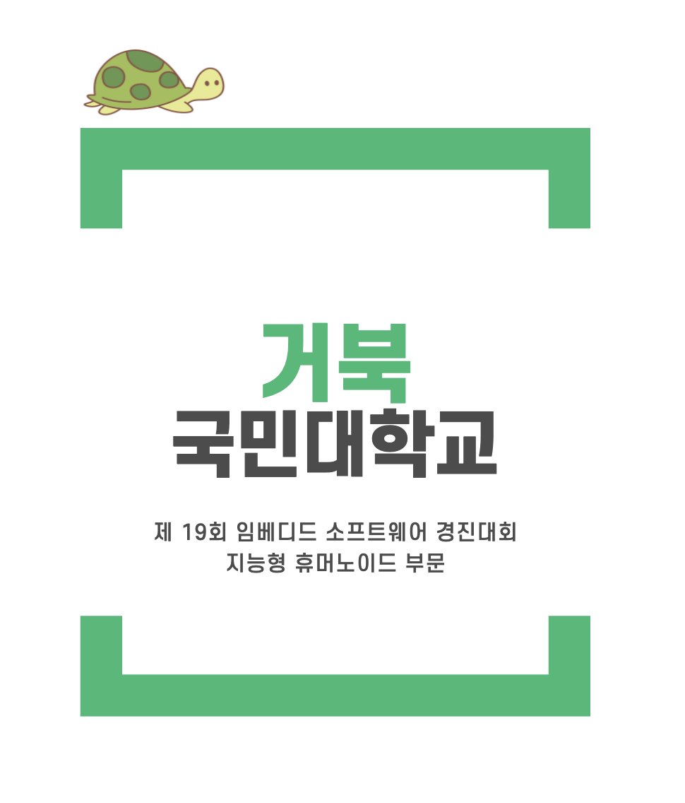

# 거북팀

|  |  대회명: [제 19회 임베디드 소프트웨어 경진대회](https://eswcontest.or.kr/main/main.php) 참가부문: 지능형 휴머노이드 주최: [산업통상자원부](http://www.motie.go.kr/www/main.do) 주관: [임베디드소프트웨어 · 시스템산업협회 (KESSIA)](https://www.kessia.kr/main/main.php) 참가번호: 2002 팀명: 거북 소속: [국민대학교](https://www.kookmin.ac.kr/user/index.do)   |
| ---------------------------------------- | ------------------------------------------------------------ |

------

## 팀원

| TEAM MEMBER   | CONTRIBUTION                                   |
| ------------- | ---------------------------------------------- |
| 박정환 (팀장) | 프로젝트 총괄. 객체 추적 및 탐지 알고리즘 담당 |
| 안솔          | 라인 트레이싱 알고리즘 담당                    |
| 박재훈        | 이미지 유사도 매칭 알고리즘 담당               |
| 김준영        | 센서 및 모터 제어, 통신 설계                   |
| 이은선        | 센서 및 모터 제어, 통신 설계                   |

